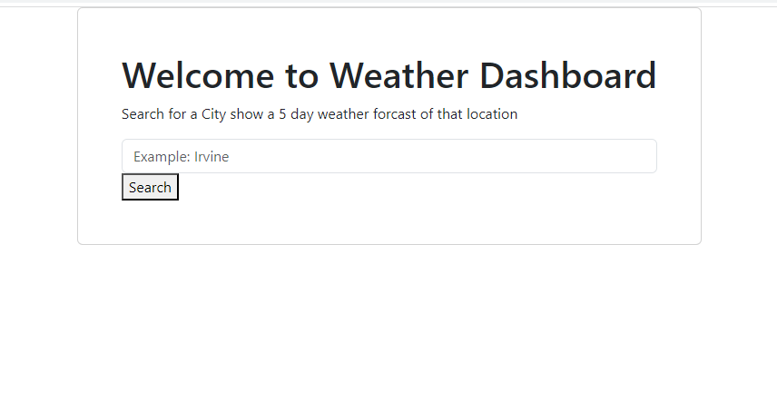

# Weather-Dashboard

## Description

This project was made to practice fetching and using API libraries. Through this project, I was able to practice javasript and also bootstrap API.

## Installation

NA

## Usage

Enter the city you want to have the weather information for and left click the "search" button.
It will now navigate you to a different page to provide the weather information.
At the results page, you can search from differnt cities by entering city names in the text input area, and left click the "search" button. 
You can save the current city by left clicking the "save location" button. Doing so will generate a button in the "Lisst of saed Cities" area. This feature uses local storage.

## Credits

Icons used in the webapp is from the following location:
[OpenWeather github](https://github.com/CodeExplainedRepo/Weather-App-JavaScript)

This webapp uses the following API libraries:
[bootstrap](https://getbootstrap.com/)
[Dayjs](https://day.js.org/)
[OpenWeather](https://openweathermap.org/)
